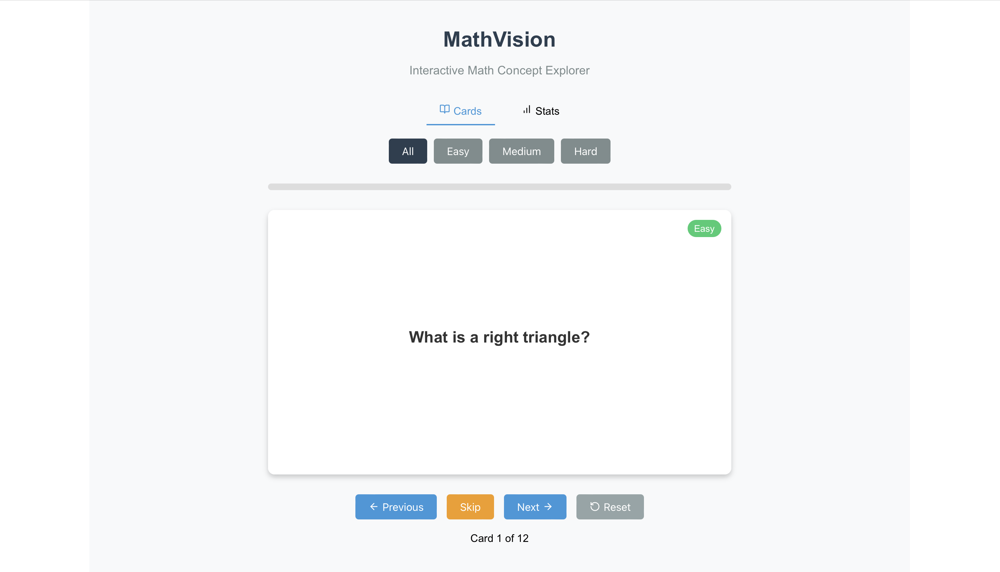
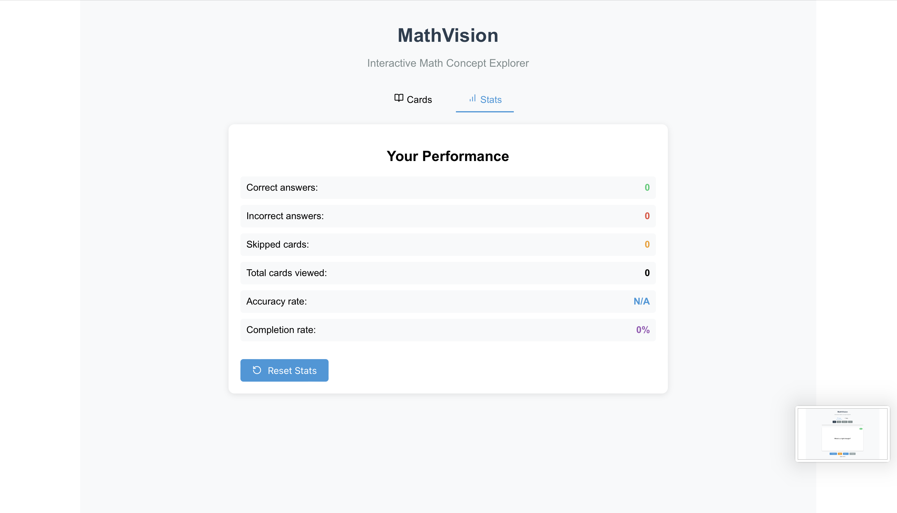

# 📐 MathVision  
**Interactive Math Concept Explorer**

MathVision is a web application that helps users explore math concepts interactively using flashcards and real-time performance tracking.

---

## 🔍 Features

- 📋 Flashcards with **three difficulty levels**: Easy, Medium, and Hard  
- 📈 Live performance **statistics tracking**  
- 🔄 Easy-to-use navigation: **Next**, **Previous**, **Skip**, and **Reset**  
- 🧠 Built for **active learning and memory reinforcement**

---

## 📸 Screenshots

### 🃏 Flashcard View


### 📊 Stats Dashboard


---

## 🚀 Getting Started

Follow these steps to run the project locally:

```bash
# 1. Clone the repository
git clone https://github.com/SanzharHDXZ/MathVision
cd skilsetik

# 2. Install dependencies
npm install

# 3. Start the development server
npm start
Then open http://localhost:3000 in your browser.

```
---

🛠️ Tech Stack

Full-Stack: React.js + CSS + JavaScript + React Hooks (useState, useEffect)

---

```bash
📁 Folder Structure
skilsetik/
├── public/
├── src/
│   └── App.js
├── screenshots/          
├── package.json
└── README.md
```
---

Serikkhan Sanzhar
Web Developer | Project Creator

Visit our website in https://mathvision.onrender.com
This project is licensed under the MIT License.